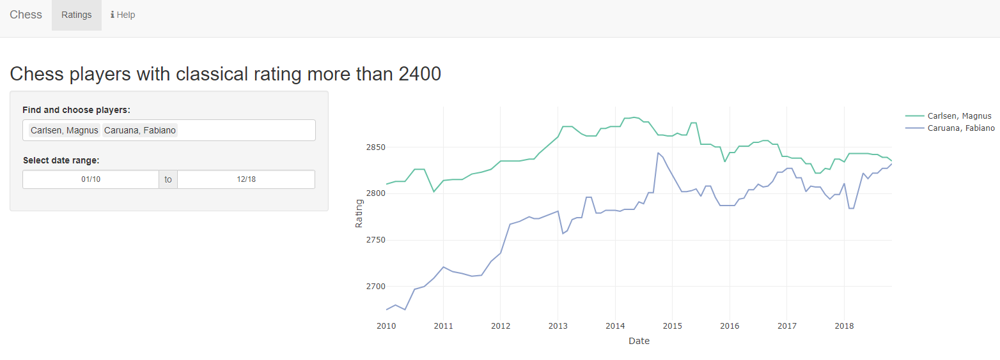

FIDE ELO ratings
========================================================
author: Ilya Maltsev
date: Dec 09, 2018
autosize: true

Developing Data Projects. Course Project

Overview
========================================================
There are several metrics to estimate strenght of chess player. The official and most commonly used metric is ELO rating. It is provided by FIDE, World Chess Federation.

The list of players and their ratings is updated every month and is available for [download](http://ratings.fide.com/download.phtml). Chess players ratings have been available electronically since 2000.

It is interesting to view rating progress of a chess player and to compare ratings of different players.

Application
========================================================
The [application](https://ilyamaltsev.shinyapps.io/fidechessratings/) is designed to show and compare chess ratings of chess players.

The data on [official FIDE page](http://ratings.fide.com/download.phtml) are archived XML files for each month. The files have different structure so they were downloaded, filtered, aggregated to one data file. To reduce amount of data only ratings higher than 2400 were retained.

The source code for the application is available at [my GitHub repository](https://github.com/maltsevilya/C9Week4CourseProjectApplication)

The source code for the presentation is available at [my GitHub repository](https://github.com/maltsevilya/C9Week4CourseProjectPresentation)

Example
========================================================
By default current most rated chess player rating is displayed. You can add another player to compare.
The date range can be changed to display required period of time.

Some thoughts about Shiny applications
========================================================
1. It is a fast and convenient way to create own application that is available all over the world.

2. It is easy to make proof-of-concept of your data application.

3. The approach seems to not satisfactory to work with large amount of data.

4. The shiny application looks well on large-screen devices but is not as good at mobile phones. At least without some advanced techniques.
